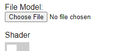
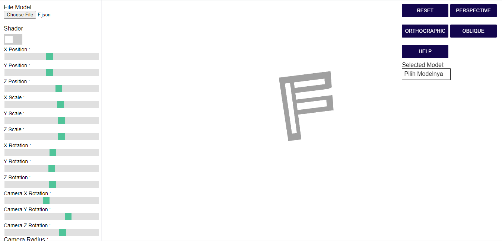
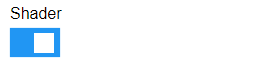
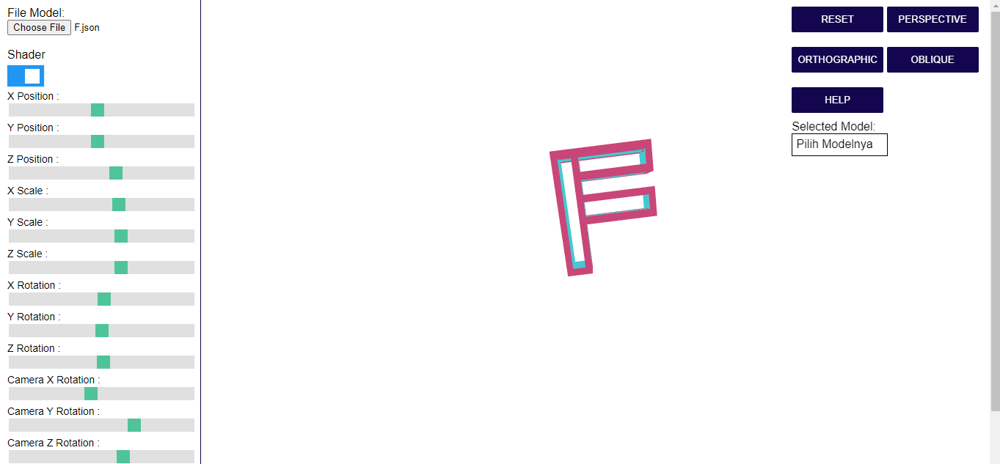
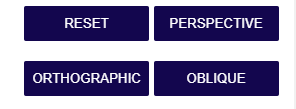
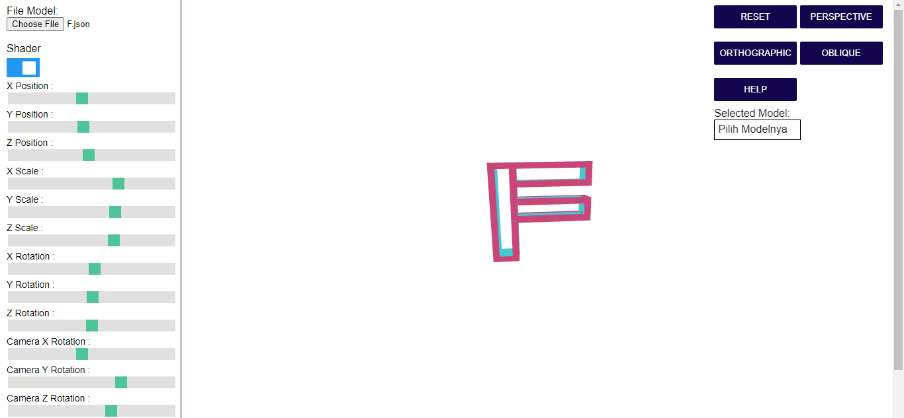
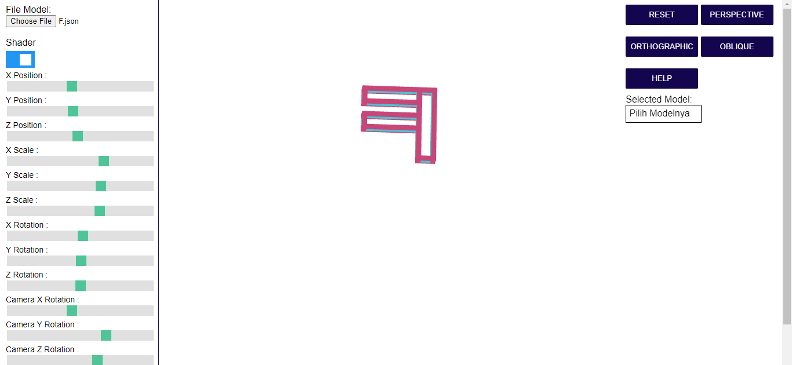
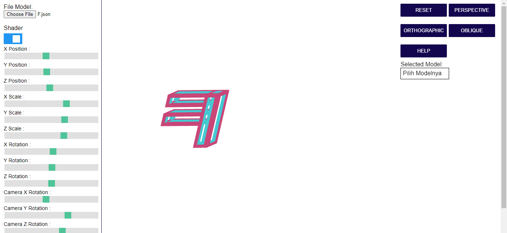
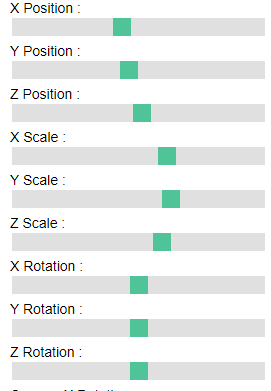
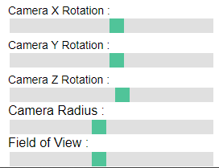

# Hollow-Object-K04-G03

Tubes 2 Grafika Komputer 2022

## Dibuat Oleh

1. 13519202 Farhan Yusuf Akbar
2. 13519208 Awwala Nisa Kamila
3. 13519215 Leonard Matheus

    <h2>I. Membuka/Load File Model</h2>
    

    <ol>
        <li>
Pada menu sidebar 'File Model:', browse file model yang telah disiapkan
</li>
        <li>
Hasil jika file model di load akan menjadi seperti berikut.
</li>
    </ol>

    <h2>II. Shading</h2>
    

    <ol>
        <li>
Untuk memberikan warna pada model, switch menu "Shader" pada sidebar
</li>
        <li>
Hasil jika shader diaktifkan akan menjadi seperti berikut.
</li>
    </ol>

    <h2>III. Mengubah jenis proyeksi</h2>
    

    <ol>
        <li>
Untuk mengubah jenis proyeksi, pilih jenis proyeksi yang diinginkan pada menu di kanan atas web app
</li>
        <li>
Hasil proyeksi perspective
</li>
        <li>
Hasil proyeksi orthographic
</li>
        <li>
Hasil proyeksi oblique
</li>
    </ol>

    <h2>IV. Rotation, Translation, Scaling</h2>
    

    <ol>
        <li>
Untuk melakukan rotasi, translasi, scaling pada model, geser slider yang ada pada sidebar
</li>
    </ol>

    <h2>V. Mengubah Jarak (Radius) Kamera View</h2>
    

    <ol>
        <li>
 Untuk mengubah jarak kamera view untuk mendekat atau menjauh dari model, geser slider yang ada sidebar
</li>
    </ol>

    <h2>VI. Reset</h2>
    

    <ol>
        <li>
 Untuk reset semua konfigurasi yang dilakukan pada model, tekan tombol 'Reset' pada menu bagian kanan atas web app
</li>
    </ol>

